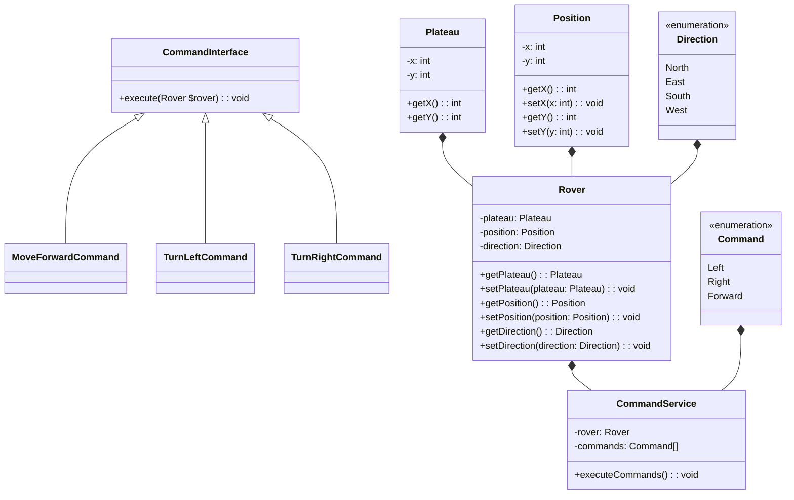

# mars-rover

```mermaid
classDiagram
    class CommandInterface {
        +execute(Rover $rover): void
    }
    CommandInterface <|-- MoveForwardCommand
    CommandInterface <|-- TurnLeftCommand
    CommandInterface <|-- TurnRightCommand

    class Plateau {
        -x: int
        -y: int
        +getX(): int
        +getY(): int
    }

    class Position {
        -x: int
        -y: int
        +getX(): int
        +setX(x: int): void
        +getY(): int
        +setY(y: int): void
    }

    class Command {
        <<enumeration>>
        Left
        Right
        Forward
    }

    class Direction {
        <<enumeration>>
        North
        East
        South
        West
    }

    class Rover {
        -plateau: Plateau
        -position: Position
        -direction: Direction
        +getPlateau(): Plateau
        +setPlateau(plateau: Plateau): void
        +getPosition(): Position
        +setPosition(position: Position): void
        +getDirection(): Direction
        +setDirection(direction: Direction): void
    }

    class CommandService {
        -rover: Rover
        -commands: Command[]
        +executeCommands(): void
    }

    Rover *-- CommandService
    Command *-- CommandService
    Plateau *-- Rover
    Position *-- Rover
    Direction *-- Rover
```
