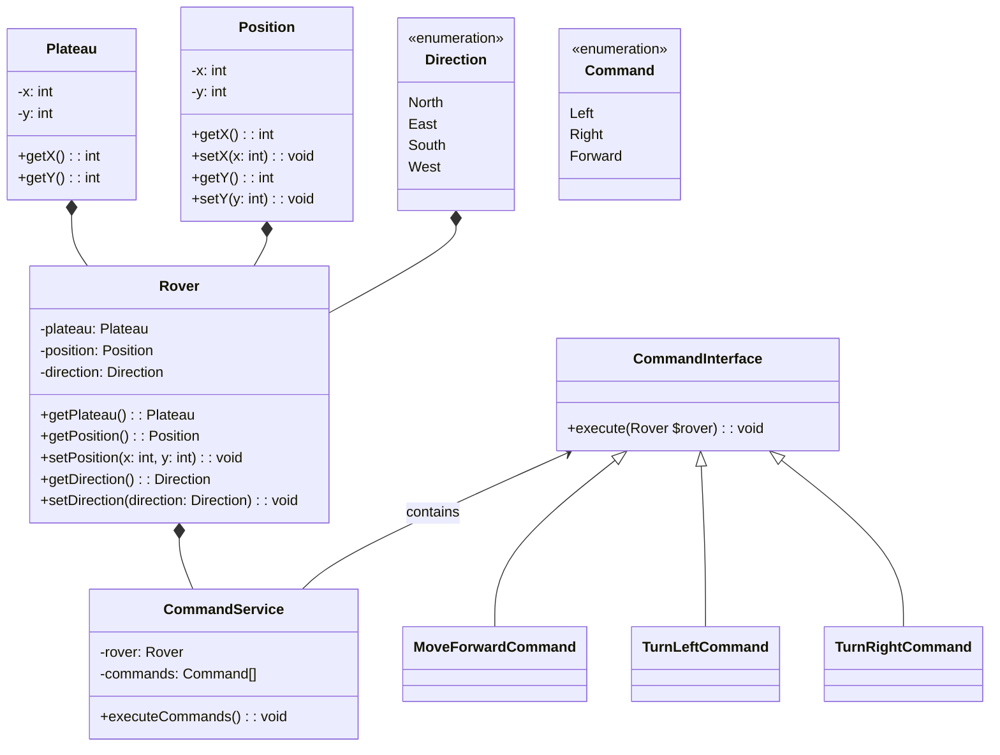

## Stack

PHP 8.2

## Installation

1. Clone the repo.
2. Open the terminal and execute `composer install`

> Composer is only used to autoload files and install PHPUnit.

## Architecture

### Command Pattern

- Command abstraction: `CommandInterface`
- Concrete command classes: `MoveForwardCommand`, `TurnLeftCommand`, and `TurnRightCommand`

## Future Directions

What if other types of rovers execute commands based on their temperature or battery life conditions? 

1. A new superclass (vehicle) will be created with shared properties between all types of rovers
2. Each unique rover will have a relationship (has a) with its relevant conditions (interfaces)

# UML diagram

If the mermaid is not rendered in your IDE, please view the 'UML Diagram.png' located in the root directory.

## Mermaid

> Please note that properties X and Y refer to the grid coordinates.

